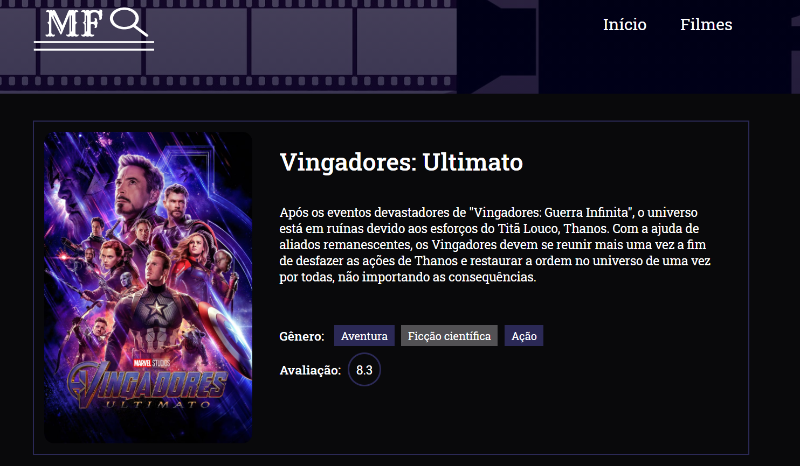

# Movies Finder

O Movies Finder é uma aplicação web desenvolvida durante o processo seletivo de um estágio na Startapp, cujo desafio era construir um site responsivo que apresenta ao usuário filmes a partir de uma API à escolha. 

## Conheça o Movies Finder

 

### Funcionalidades disponíveis

 

- O usuário poderá fazer a busca pelo filme que desejar. A aplicação retornará resultado(s) contanto que o que foi pesquisado esteja disponível na base de dados. 

 

- O usuário poderá ver mais detalhes do filme que desejar   

 

- O usuário poderá conferir os filmes mais recentes, mais populares e mais votados

### O que foi usado para desenvolver?

- ReactJs
- Typescript
- TMDB API
